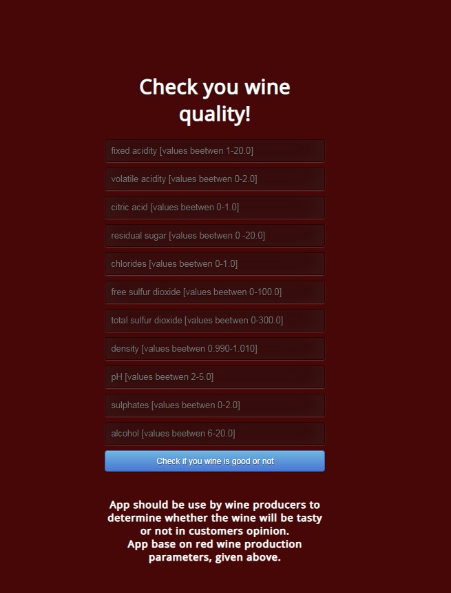

# wine_quality_detector

In this case I've tried to prepare a good model, which can be use by red wine producers, to estimate whether their wines will be tasty or not.

I have used RandomForrest and XGBClassifier to find the highest F1-score.  
Due to unbalanced classes, results are not ideal, we have only 64% F1-score for class 2 (Good Wine), 95% for class 1.  

nevertheless model has been implemented and predictions results can be reached [here](https://wine-quality-app-1.herokuapp.com).  
App View is presented below:  

------------
In future model will be imporved by using deep learnings methods.  

Data set: winequality-red.csv was used to create model.

